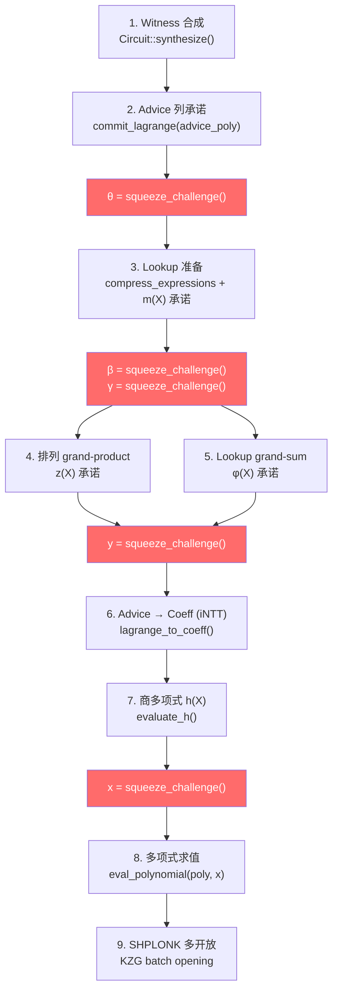

# 想法 1 可行性深度分析：连续后端证明之间的动态数据复用

> 基于 [halo2](https://github.com/zkonduit/halo2) (branch `ac/conditional-compilation-icicle2`) 和 [ezkl](https://github.com/zkonduit/ezkl) 源码分析

---

## 1. 关键发现摘要

> [!CAUTION]
> **Fiat-Shamir 转录本使动态数据复用在数学上几乎不可能。** 几乎所有后端证明中间结果都依赖于证明特定的随机挑战值 (θ, β, γ, y, x)，这些值通过 Fiat-Shamir 哈希从该证明的唯一转录本中导出。即使 ezkl 支持将大模型切分为多个子图并分别证明，由于每个子证明的挑战值必然不同，依赖这些挑战的中间计算结果依然**无法跨证明复用**。

> [!NOTE]
> **ezkl 现已支持基于多项式承诺方案（Proof Splitting）的模型切分机制。** 开发者可以通过 `onnx.utils.extract_model` 将大模型切分成子模型，利用 `polycommit` 的数据可见性并在外部使用 `swap_proof_commitments` 拼接多个子证明。了解这套现有的框架可以帮助我们更精准地设计硬件加速方案。

---

## 2. Halo2 证明生成数据流分析

基于 [plonk/prover.rs](file:///tmp/halo2_source/halo2_proofs/src/plonk/prover.rs) 的 [create_proof](file:///tmp/halo2_source/halo2_proofs/src/plonk/prover.rs#48-833) 函数，证明生成分为以下阶段：



**红色节点**是通过 Fiat-Shamir 从转录本导出的随机挑战。每个挑战都**依赖于此前写入转录本的所有承诺点**。

---

## 3. 逐项复用机会分析

### 3.1 边界 witness 多项式共享 — ⚠️ 极度有限

**原始假设：** 分区 *i* 的输出激活 = 分区 *i+1* 的输入激活 → 多项式系数和 NTT 结果可保留。

**源码分析结果：**

advice 列的生成（[prover.rs:321-452](file:///tmp/halo2_source/halo2_proofs/src/plonk/prover.rs#L321-L452)）：
```rust
// 1. 每个 advice 列独立存储在 Polynomial<Scalar, LagrangeCoeff>
// 2. 从 Lagrange 基到系数基的转换（iNTT）在 line 627-643
advice_polys.into_iter()
    .map(|poly| domain.lagrange_to_coeff(poly))  // iNTT
```

**问题分析：**
- 即使两个分区共享边界激活值，它们在电路中出现的**行位置**不同（分区 *i* 的输出在最后几行，分区 *i+1* 的输入在开头几行），导致 Lagrange 基多项式完全不同
- iNTT 是全局操作，改变一个点的值会改变**所有**系数
- **结论：部分 NTT 结果不可复用**，因为即使共享值出现在不同行索引

### 3.2 查找表论证中间数据复用 — ❌ 不可行

**原始假设：** 连续分区使用相同 lookup table → 排序置换和 NTT 表示可缓存复用。

**源码分析结果：** mv_lookup 的 [prepare](file:///tmp/halo2_source/halo2_proofs/src/plonk/mv_lookup/prover.rs#89-243) 方法（[mv_lookup/prover.rs:89-242](file:///tmp/halo2_source/halo2_proofs/src/plonk/mv_lookup/prover.rs#L89-L242)）：

1. **compressed_table_expression** (line 137): 表达式通过 `theta` 线性组合压缩

   ```rust
   let compressed_table_expression = compress_expressions(&self.table_expressions);
   // compress 使用 theta: acc * *theta + &expression
   ```
   `theta` 是从转录本导出的挑战值。**不同证明的 theta 不同 → compressed_table 不同**。

2. **m_values** (line 155-183): multiplicity 向量，统计每个输入出现的次数
   ```rust
   m_values[*index].fetch_add(1, Ordering::Relaxed);
   ```
   m_values 依赖于 advice 列的具体值——不同分区有不同的 witness。

3. **grand-sum φ(X)** (line 246-491): [commit_grand_sum](file:///tmp/halo2_source/halo2_proofs/src/plonk/mv_lookup/prover.rs#246-492) 依赖 `beta` 挑战
   ```rust
   // (Σ 1/(φ_i(X)) - m(X) / τ(X)) 其中 φ_i(X) = f_i(X) + beta
   *input_log_derivative = *beta + fi;
   ```

**结论：lookup 的每一步中间结果都依赖于证明特定的挑战值 (θ, β)，完全无法跨证明复用。**

### 3.3 排列论证数据流复用 — ❌ 不可行

**源码分析结果：** [permutation/prover.rs:46-240](file:///tmp/halo2_source/halo2_proofs/src/plonk/permutation/prover.rs#L46-L240)

grand-product 多项式 z(X) 的构建：
```rust
// 分母: (p_j(ω^i) + β·s_j(ω^i) + γ) 依赖 β, γ
*modified_values *= &(*beta * permuted_value + &*gamma + value);

// 分子: (p_j(ω^i) + δ^j·ω^i·β + γ) 依赖 β, γ
*modified_values *= &(deltaomega * &*beta + &*gamma + value);
```

z(X) 是累积积 `z[i] = z[i-1] * modified_values[i-1]`，每个元素都依赖 β 和 γ。

**结论：不同证明的 β, γ 不同 → grand-product 完全不同，无法复用。**

### 3.4 部分多项式求值复用 — ❌ 不可行

**源码分析结果：** [prover.rs:692-724](file:///tmp/halo2_source/halo2_proofs/src/plonk/prover.rs#L692-L724)

```rust
let advice_evals: Vec<_> = meta.advice_queries.par_iter()
    .map(|&(column, at)| {
        eval_polynomial(&advice.advice_polys[column.index()],
                       domain.rotate_omega(*x, at))
    })
    .collect();
```

求值点是 `x` 的旋转变体，`x` 是最终挑战值。

**结论：不同证明的 x 不同 → 求值点不同 → 求值结果不同，不可复用。**

### 3.5 SHPLONK 多开放 — ❌ 不可行

**源码分析结果：** [shplonk/prover.rs:106-298](file:///tmp/halo2_source/halo2_proofs/src/poly/kzg/multiopen/shplonk/prover.rs#L106-L298)

SHPLONK 引入额外挑战 (y, v, u)，整个过程依赖于此前所有步骤写入转录本的值。

---

## 4. 真正可复用的数据（静态数据）

虽然动态中间结果不可复用，以下**静态/协议级数据**可以在证明之间共享（但这不属于"动态数据复用"）：

| 数据 | 是否可复用 | 说明 |
|------|:---:|------|
| NTT twiddle factor 表 | ✅ | 仅依赖于多项式度 n = 2^k |
| SRS 生成元点 (KZG) | ✅ | 固定参数 |
| 固定列多项式 `pk.fixed_polys` | ✅ | 不同分区可能有不同固定列 |
| 验证密钥 | ✅ | 每个分区有自己的 VK |
| EvaluationDomain (ω, n, etc.) | ✅ | 仅依赖于 k |
| proving key 中的预计算 | ✅ | 相同电路结构可共享 |

---

## 5. 根本原因：Fiat-Shamir 随机预言模型

```
Proof_i 转录本:  VK_i → advice_commits_i → θ_i → lookup_commits_i → β_i, γ_i → ...
Proof_{i+1} 转录本:  VK_{i+1} → advice_commits_{i+1} → θ_{i+1} → ...
```

即使两个分区共享完全相同的 VK，只要 advice（witness）不同，`advice_commits` 就不同 → `θ` 不同 → 后续所有挑战不同 → **所有依赖挑战的中间计算全部不同**。

这是零知识证明的**安全性基础**——如果中间数据可以跨证明复用，就意味着证明者可以预测挑战值，这将破坏 soundness。

---

## 6. 修订后的想法 1 方向建议

> [!TIP] 
> 既然动态数据复用在协议层面不可行，建议将想法 1 重新聚焦到以下可行方向：

### 方向 A：同构子电路的硬件资源复用（推荐 ★★★★★）
- 如果证明感知切分使得连续分区产生**相同结构的电路**（相同 k 值、相同列数、相同约束配置），则：
  - **证明密钥可共享** → 不需要每个分区单独生成/加载 PK
  - **NTT/iNTT 硬件配置不变** → 蝶形运算网络无需重配置
  - **MSM 基点表不变** → 同一 SRS 子集可常驻片上存储
  - 这是**硬件级**复用，减少的是配置开销和存储带宽，不是计算量

### 方向 B：流水线调度优化（与想法 2 合并）
- 既然证明 *i* 和证明 *i+1* 的数据无法共享，那最好的优化是**时间重叠**：
  - 在生成 Proof *i* 的 SHPLONK 阶段时，开始 Proof *i+1* 的 witness 合成
  - 这已经是想法 2 的范围

### 方向 C：批量证明（Batch Proving）
- 不做 N 个独立证明，而是将 N 个分区合并为一个**聚合电路**
- 一次 [create_proof](file:///tmp/halo2_source/halo2_proofs/src/plonk/prover.rs#48-833) 调用覆盖所有分区 → 内部自然可以共享挑战值
- halo2 已支持在一次 [create_proof](file:///tmp/halo2_source/halo2_proofs/src/plonk/prover.rs#48-833) 中传入多个 circuits（[prover.rs:63](file:///tmp/halo2_source/halo2_proofs/src/plonk/prover.rs#L63): `circuits: &[ConcreteCircuit]`），所有 circuit 共享同一组 Fiat-Shamir 挑战
- 代价：电路需统一大小（取最大的 k）

---

## 7. ezkl 模型切分现状

> [!NOTE]
> ezkl 原生提供了 **Proof Splitting（证明切分）** 回避内存瓶颈的解决方案。

- **ONNX 模型级切分**：在模型前处理阶段，利用 `onnx.utils.extract_model` 处理 ONNX 模型，按照指定的计算图节点将其切分为多个子模型。
- **证明图拼接机制（Stitching）**：
  - **公开中间变量拼接**：如果各个子电路之间的截断数据可以公开，只需将边界张量的 visibility 设置为 `public`，两者通过一致的 `instance` 变量拼接。
  - **KZG 聚合物承诺拼接（polycommit）**：对于需要保密的边界数据，ezkl 通过引入 `polycommit` 可见性机制，结合 KZG 承诺的同态属性实现拼接。各部分生成完证明后，调用 `swap_proof_commitments` 外部验证机制连接模型接口的输入与输出。
- **独立证明生成**：每一个子模型切片都在 ezkl 下走完整且**独立**的编译过程（如 `gen_settings`, `setup`, `prove`）。这意味着每一个切片必然产生相互隔离的证明与相互独立的 Fiat-Shamir 转录本。

**对想法 1 的影响：** 鉴于 ezkl 现已提供了清晰的模型切分与拼接的工作流，硬件加速器在设计时**不再需要**从头构建切分逻辑。我们可以直接对标 ezkl 的 Proof Splitting 工作流进行硬件流水线化。然而，由于每个切片在 ezkl 中均是调用完整的 `prove` 以生成独立的转录本和挑战点，这反过来更加坚固了我们之前的结论：即基于这些特定挑战的动态计算中间状态（如 iNTT 的结果、grand-product等）严格无法跨证明连续复用。我们仍需把重心放在静态计算数据的共享与不同子电路之间的流水线重叠上（如想法 2 和想法 3）。

---

## 8. 结论

| 复用类型 | 可行性 | 原因 |
|----------|:---:|------|
| 边界 witness 多项式共享 | ❌ | 不同行索引 → 不同 Lagrange 基多项式 |
| Lookup 中间数据 | ❌ | 依赖 θ, β 挑战值 |
| 排列 grand-product | ❌ | 依赖 β, γ 挑战值 |
| 多项式求值 | ❌ | 求值点 x 证明特定 |
| SHPLONK 开放 | ❌ | 依赖 y, v, u 挑战值 |
| **静态数据（twiddle, SRS, PK）** | **✅** | 仅依赖电路结构，非 witness |

**核心结论：** Fiat-Shamir 转录本使得**所有动态中间计算结果都是证明特定的**，无法在连续后端证明之间复用。可复用的仅限于与电路结构相关的静态数据。建议将想法 1 重定向为"同构子电路硬件资源复用"或与想法 2 合并。
